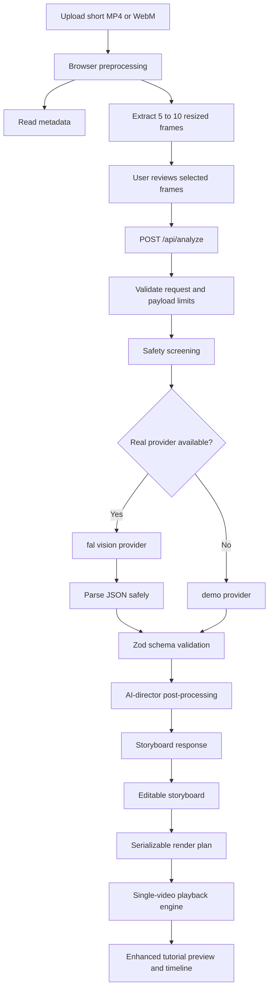

# GhostCrew

Film once. Teach clearly.

GhostCrew turns one rough phone recording of a simple physical task into a clearer tutorial plan. The MVP focuses on short, non-dangerous tasks and uses browser-side video preprocessing plus server-side multimodal instructional analysis.

## Problem

Simple how-to videos are often recorded in a single take with weak framing, no narration, and unclear timing. The viewer can miss key hand-object interactions, orientation changes, or fast locking motions.

## Solution

GhostCrew analyzes a short source clip, extracts representative frames, detects instructional steps, and recommends AI-director treatments such as:

- keep original footage
- crop into a close-up
- slow down a fast action
- freeze a key frame
- annotate a confusing orientation
- reserve generated inserts for genuinely missing visual context

The current milestone delivers a validated storyboard plus a real browser-based enhanced tutorial preview driven by the original uploaded video. It does not render or export a final MP4 yet.

## Target Users

- artisans
- teachers
- makers
- small business owners
- content creators
- anyone documenting a simple, non-dangerous physical task

## Current Feature Set

- landing page and upload flow
- browser-side video metadata extraction
- browser-side representative frame extraction and selection
- strict request validation before analysis
- server-side multimodal instructional analysis
- provider-independent analysis architecture
- demo fallback analysis
- editable storyboard with confidence and evidence frames
- deterministic render-plan generation
- browser-based enhanced tutorial playback with timeline controls
- crop, slow-motion, freeze-frame, annotation, and generated-insert fallback preview

## Architecture



## Browser-Side Preprocessing

- Source video metadata is extracted with native browser `video` APIs.
- Representative frames are extracted with native `video` and `canvas` APIs.
- Frames are distributed across the clip duration and include early and late coverage.
- Frames are resized to a maximum dimension of `640px`.
- Frames are encoded as `image/webp` when possible, with browser fallback handling in preprocessing code.
- Only selected frames plus metadata are sent to the server for analysis.

## Why Raw Video Is Not Sent To The Server Yet

- The MVP only needs lightweight multimodal context for step inference.
- Sending the full video would increase latency, payload size, and server complexity.
- Frame-based analysis is easier to validate and cheaper to operate during the hackathon.
- This keeps the analysis path resilient while video rendering is still out of scope.

## Analysis Architecture

Relevant modules:

- `lib/analysis/video-analysis-provider.ts`
- `lib/analysis/fal-video-analysis-provider.ts`
- `lib/analysis/demo-video-analysis-provider.ts`
- `lib/analysis/analyze-tutorial.ts`
- `lib/analysis/prompts.ts`
- `lib/analysis/post-process.ts`
- `lib/analysis/safety.ts`

Flow:

1. Validate the request body with Zod and additional payload checks.
2. Reject malformed frame payloads, timestamp inconsistencies, and oversized requests.
3. Screen the task title and description for unsafe categories.
4. Use the real fal provider when `FAL_KEY` is configured.
5. Parse provider output as strict JSON and run Zod validation.
6. Post-process the storyboard deterministically to enforce chronology, evidence integrity, and safer treatment choices.
7. Fall back to the demo provider when configured and necessary.

## Rendering Architecture

Relevant modules:

- `lib/rendering/render-plan.ts`
- `lib/rendering/build-render-plan.ts`
- `lib/rendering/treatment-rules.ts`
- `hooks/use-tutorial-playback.ts`
- `components/enhanced-tutorial-player.tsx`
- `components/tutorial-timeline.tsx`
- `components/annotation-overlay.tsx`

Flow:

1. Use the validated storyboard plus source-video metadata to build a strict serializable render plan.
2. Convert each step into a segment with source timing, output timing, treatment settings, subtitles, and overlays.
3. Drive the enhanced tutorial with one source `video` element when possible.
4. Use CSS transforms for deterministic crops, playback-rate changes for slow motion, and canvas capture only for freeze-frame fallbacks.
5. Overlay subtitles and normalized annotations on top of the active segment.
6. Keep generated inserts as planned-but-pending steps with a deterministic fallback treatment so the full tutorial remains playable.

## fal Model Selection

Selected endpoint:

- `openrouter/router/vision`

Selected model:

- `google/gemini-2.5-flash`

Why this was selected:

- fal currently exposes `openrouter/router/vision` as an official vision-language endpoint for one or multiple images.
- The official schema accepts `image_urls`, `prompt`, `system_prompt`, and `model`, which fits GhostCrew's frame-based analysis design.
- The official examples show `google/gemini-2.5-flash` on this endpoint, making it a pragmatic low-latency choice for instructional reasoning across a small frame set.
- The endpoint returns usage metadata, which helps estimate token-based cost during the hackathon.

Official documentation references:

- https://fal.ai/models/openrouter/router/vision/api
- https://fal.ai/docs/model-api-reference/vision-api/openrouter-router

## Official Parameters Used

GhostCrew currently sends the following documented input fields to fal:

- `model`
- `prompt`
- `system_prompt`
- `image_urls`
- `temperature`
- `max_tokens`
- `reasoning`

Notes:

- `image_urls` is supplied as an ordered list of frame Data URLs.
- Multiple images are supported by the official endpoint.
- The endpoint returns `output` as a string plus `usage`, so GhostCrew performs safe JSON parsing and validation server-side.
- Native schema-constrained JSON output is not guaranteed by this endpoint, so GhostCrew uses strict prompting plus one controlled repair pass.

## AI Workflow

1. The client collects task title, optional description, language, metadata, and selected frames.
2. The server validates the payload and aggregate image size.
3. GhostCrew prompts the model to return either:
   - a strict safe storyboard JSON object
   - an unsafe-task JSON object
4. The response is parsed, validated, and post-processed.
5. The UI shows:
   - analysis source
   - warnings
   - confidence per step
   - evidence thumbnails
   - recommended treatment

## Render-Plan Contract

```json
{
  "sourceDurationSeconds": 24.2,
  "durationSeconds": 28.7,
  "segments": [
    {
      "id": "segment-step-1",
      "stepId": "step-1",
      "stepNumber": 1,
      "title": "Open the base",
      "subtitle": "Open the base carefully.",
      "confidence": 0.78,
      "evidenceFrameIds": ["frame-1", "frame-2"],
      "requestedTreatment": "crop_close_up",
      "treatment": "crop_close_up",
      "sourceStartTime": 0,
      "sourceEndTime": 4,
      "sourceDurationSeconds": 4,
      "outputStartTime": 0,
      "outputEndTime": 4,
      "outputDurationSeconds": 4,
      "playbackRate": 1,
      "cropPreset": "center",
      "crop": {
        "x": 0.18,
        "y": 0.18,
        "width": 0.64,
        "height": 0.64
      },
      "freezeFrameTimestamp": null,
      "freezeFrameDurationSeconds": null,
      "freezeFrameSourceFrameId": null,
      "annotations": [],
      "generatedInsertPending": false,
      "generatedInsertPrompt": null,
      "generatedInsertFallbackTreatment": null
    }
  ]
}
```

Coordinate rules:

- crop coordinates are normalized between `0` and `1`
- annotation coordinates are normalized between `0` and `1`
- normalized coordinates are clamped into valid bounds before playback
- annotation timing is stored as segment-relative offsets in seconds

## Request Contract

`POST /api/analyze`

```json
{
  "taskTitle": "Assemble a phone stand",
  "description": "Optional task context",
  "language": "English",
  "video": {
    "fileName": "phone-stand.mp4",
    "mimeType": "video/mp4",
    "fileSizeBytes": 5200000,
    "durationSeconds": 24.2,
    "width": 1920,
    "height": 1080,
    "aspectRatio": 1.7778,
    "aspectRatioLabel": "16:9"
  },
  "selectedFrames": [
    {
      "id": "frame-1",
      "timestampSeconds": 0.35,
      "imageDataUrl": "data:image/webp;base64,...",
      "mimeType": "image/webp",
      "width": 640,
      "height": 360,
      "byteSize": 32000
    }
  ]
}
```

## Response Contract

```json
{
  "analysis": {
    "taskTitle": "Assemble a phone stand",
    "summary": "A short instructional storyboard.",
    "steps": [
      {
        "id": "step-1",
        "title": "Show the folded stand",
        "instruction": "Show the folded stand before opening it.",
        "startTime": 0,
        "endTime": 4.5,
        "importance": "medium",
        "visibility": "partial",
        "viewerRisk": "The starting orientation may be unclear.",
        "treatment": "annotation",
        "generationPrompt": null,
        "evidenceFrameIds": ["frame-1", "frame-2"],
        "confidence": 0.71,
        "reasoningSummary": "The beginning orientation benefits from a label."
      }
    ]
  },
  "provider": "fal",
  "model": "google/gemini-2.5-flash",
  "fallbackUsed": false,
  "warnings": [],
  "usage": {
    "selectedFrameCount": 5,
    "aggregateImageBytes": 160000,
    "latencyMs": 1420
  }
}
```

## Supported Treatments

- `keep_original`
  - Plays the storyboard range directly from the original clip.
- `crop_close_up`
  - Uses CSS-based deterministic zooming into the source video with editable crop presets and custom adjustment.
- `slow_motion`
  - Uses playback-rate slowdown from the original source clip.
- `freeze_frame`
  - Uses an evidence frame when available or captures a still from the source clip with canvas.
- `annotation`
  - Overlays arrows, highlight boxes, and labels on top of the active segment.
- `generated_insert`
  - Does not generate media yet. GhostCrew marks the segment as pending and falls back to a deterministic treatment.

## Playback Strategy

- One source `video` element is reused across sequential segments whenever possible.
- Segment transitions are controlled by source start and end timestamps plus per-segment playback rate.
- Freeze-frame segments pause source playback and hold a still image for a configurable duration.
- Current output time, active segment, and total duration are derived from the render plan rather than from raw source playback alone.
- The tutorial timeline supports segment preview, full-sequence play, pause, restart, and jump-to-step.

## Generated Insert Fallback

GhostCrew does not call fal media-generation models in this milestone.

When a step requests `generated_insert`:

- the render plan marks the insert as pending
- the UI shows a non-blocking pending badge
- GhostCrew chooses a deterministic fallback treatment:
  - `freeze_frame` when the main issue is orientation ambiguity
  - `crop_close_up` when the relevant detail already exists in the source footage
  - `annotation` when a label or highlight is enough

This keeps the tutorial fully playable even before generative inserts exist.

## Validation And Safety Limits

Video constraints:

- formats: `video/mp4`, `video/webm`
- duration: `10` to `45` seconds
- max upload size: `80 MB`

Frame constraints:

- extracted frames: `5` to `10`
- selected analysis frames: `3` to `10`
- max review frame dimension: `640px`
- supported frame MIME types: `image/webp`, `image/jpeg`
- max aggregate selected-frame payload: `8 MB`

Analysis constraints:

- storyboard must contain `3` to `6` steps
- step confidence must be between `0` and `1`
- evidence frame IDs must reference submitted frames
- timestamps must remain within source duration
- steps are sorted and normalized chronologically
- low-confidence `generated_insert` recommendations are downgraded server-side

Render constraints:

- render-plan segments are normalized into chronological source ranges
- segment output timing is recomputed deterministically after treatment changes
- slow motion supports `0.5x` and `0.75x`
- freeze-frame duration is currently clamped between `1.5` and `3` seconds
- crop coordinates are normalized and clamped to source bounds
- generated inserts remain deterministic fallbacks until media generation is added

Unsafe task categories rejected or flagged:

- medical procedures
- self-harm
- weapons
- electrical repair
- dangerous machinery
- illegal activity
- hazardous chemicals

## Fallback Behavior

Environment strategy:

- `FAL_KEY` is server-only and must never be exposed to the browser.
- `FAL_VISION_ENDPOINT_ID` and `FAL_VISION_MODEL` are server-side configuration.
- `DEMO_FALLBACK_ENABLED` controls server fallback behavior.
- `NEXT_PUBLIC_DEMO_MODE` is UI-safe and only indicates whether demo mode is available in the product experience.

Runtime behavior:

- `FAL_KEY` configured and provider succeeds: use real AI analysis.
- `FAL_KEY` absent and fallback enabled: use demo analysis.
- real provider fails and fallback enabled: use demo analysis and return a warning.
- real provider fails and fallback disabled: return a controlled provider error.

## Approximate Cost

The selected fal endpoint is documented as token-usage based. The official docs indicate the `model` is charged based on actual token usage and the output includes a `usage.cost` field.

That means cost depends on:

- selected underlying model
- prompt size
- number and size of submitted frames
- response length

GhostCrew currently minimizes cost by:

- capping the selected frame count
- resizing frames client-side
- using short, structured prompts
- avoiding repeated provider retries

## Local Development

Use Node.js 20 or newer.

Install dependencies:

```bash
npm install
```

Start the app:

```bash
npm run dev
```

Run checks:

```bash
npm test
npm run lint
npm run typecheck
npm run build
```

## Environment Variables

Copy `.env.example` to `.env.local`.

```bash
FAL_KEY=
FAL_VISION_ENDPOINT_ID=openrouter/router/vision
FAL_VISION_MODEL=google/gemini-2.5-flash
DEMO_FALLBACK_ENABLED=true
NEXT_PUBLIC_APP_URL=http://localhost:3000
NEXT_PUBLIC_DEMO_MODE=true
```

## Demo Instructions

1. Open `/create`.
2. Upload a short MP4 or WebM clip.
3. Wait for browser-side metadata extraction and frame extraction.
4. Review the extracted film strip and keep 3 to 10 relevant frames selected.
5. Enter the task title, optional context, and tutorial language.
6. Start analysis.
7. Review the storyboard, warnings, confidence, and evidence thumbnails.
8. Edit titles, instructions, or treatment recommendations as needed.
9. Compare the original clip against the enhanced preview.
10. Adjust crop presets, slow-motion rate, freeze-frame duration, and annotation labels in the enhanced player.

## Known Limitations

- This milestone analyzes selected frames, not the full source video stream.
- Native browser seeking can land slightly off the requested frame timestamp.
- The chosen fal endpoint returns free-form text output, so JSON structure is enforced through prompting plus server-side validation rather than a native schema contract.
- The enhanced tutorial preview is browser-driven and not yet exported as a rendered video file.
- No narration, audio generation, final MP4 export, or cloud storage is implemented yet.
- Because the model sees only representative frames, it can miss micro-actions that happen between sampled timestamps.
- `crop_close_up` currently uses deterministic CSS transforms rather than tracked object detection.
- `slow_motion` currently uses playback-rate slowdown and not AI frame interpolation.
- `generated_insert` is previewed through fallback treatments only.

## Why FFmpeg Is Not Used Yet

- The current milestone prioritizes a reliable in-browser preview over final-file rendering complexity.
- Normal browser playback, CSS transforms, and selective canvas capture are enough to demonstrate the instructional direction logic.
- Adding `ffmpeg.wasm` now would significantly increase bundle size, startup time, and failure surface without improving the live demo as much as the current playback layer does.

## Browser And Codec Limitations

- The preview depends on the browser being able to decode the uploaded MP4 or WebM source file.
- Native video seeking can still land slightly off an exact frame boundary, especially around keyframes.
- Freeze-frame capture depends on browser canvas support and same-session source-video playback.
- Some browsers handle playback-rate audio or video smoothing differently, although GhostCrew currently focuses on visual clarity rather than audio fidelity.

## Safety Principles

- focus on simple, non-dangerous tasks
- original footage remains the source of truth
- generated media is supplementary only
- reject tasks where incorrect instructions could cause serious harm
- never expose secrets or raw provider payloads to the browser

## Hackathon Statement

GhostCrew is being built from scratch during the fal × Sequoia 72-Hour Video Hackathon. No code, assets, prompts, media, components, designs, or repositories from previous projects are being reused.

## License

MIT
