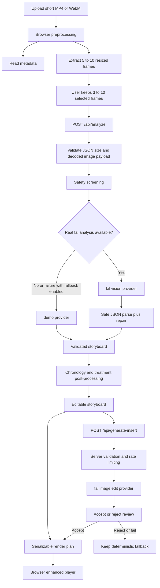

# GhostCrew

Film once. Teach clearly.

GhostCrew turns one rough phone recording of a simple physical task into a clearer tutorial. The app analyzes selected frames from the clip, builds a structured storyboard, applies deterministic instructional treatments to the original footage, and optionally adds one explicitly approved AI-generated supplementary view.

## Problem

Short how-to videos are often filmed once, handheld, and without narration. Important steps happen too quickly, key details are small in frame, and orientation changes are easy to miss.

## Solution

GhostCrew behaves like an AI instructional director:

- understand the task being shown
- segment it into 3 to 6 steps
- detect what the viewer may miss
- recommend the right treatment for each step
- keep the original footage as the source of truth

## Target Users

- artisans
- teachers
- makers
- small business owners
- content creators
- anyone explaining a simple, non-dangerous physical task

## Key Innovation

GhostCrew is not just an editor and not a full generative-video system. It uses a hybrid approach:

- original source footage for factual actions
- deterministic crops, slow motion, freeze frames, and annotations for clarity
- one optional AI-generated supplementary view only when the source footage is not enough

## Feature Set

- landing page and upload flow
- browser-side video metadata extraction
- browser-side frame extraction and frame review
- strict request validation and payload-size enforcement
- server-side multimodal instructional analysis
- demo fallback analysis
- editable storyboard with confidence and evidence frames
- deterministic render-plan generation
- browser-based enhanced tutorial playback
- crop close-up, slow motion, freeze frame, and annotation treatments
- explicit fal-powered supplementary still generation with accept/reject review
- before/after comparison view

## Architecture



## AI Workflow

1. The browser reads source-video metadata and extracts representative frames with native `video` and `canvas` APIs.
2. The user selects the frames that best represent the task.
3. `POST /api/analyze` validates the request, enforces size limits, screens for unsafe tasks, and calls either the real fal analysis provider or the demo fallback.
4. The validated storyboard is editable in the UI.
5. The browser builds a strict render plan from the storyboard plus source-video metadata.
6. The enhanced player reuses the original video as the factual source and applies deterministic treatments.
7. If the user explicitly requests one generated insert, `POST /api/generate-insert` validates the selected evidence frame, rate-limits the request, and asks fal for a supplementary still image.
8. The user must accept that result before it enters playback.

## fal Models

### Analysis

- Endpoint ID: `openrouter/router/vision`
- Model ID: `google/gemini-2.5-flash`
- Purpose: multimodal step inference over ordered evidence frames

Why it was selected:

- official fal vision endpoint with multi-image support
- low-latency fit for frame-based instructional analysis
- returns usage metadata for cost tracking

Official references:

- https://fal.ai/models/openrouter/router/vision/api
- https://fal.ai/docs/model-api-reference/vision-api/openrouter-router

### Supplementary Insert

- Endpoint ID: `fal-ai/nano-banana-2/edit`
- Model ID: `fal-ai/nano-banana-2/edit`
- Purpose: generate one supplementary explanatory still from an evidence frame

Why it was selected:

- official reference-image editing workflow
- accepts `image_urls`, including base64 Data URIs
- predictable 1K still-image pricing
- reliable hosted output URL for browser playback

Official references:

- https://fal.ai/models/fal-ai/nano-banana-2/edit/api
- https://fal.ai/models/fal-ai/nano-banana-2/edit

Researched but intentionally not integrated:

- `fal-ai/kling-video/o3/standard/image-to-video`

## Official Parameters Used

### Analysis request to fal

- `model`
- `prompt`
- `system_prompt`
- `image_urls`
- `temperature`
- `max_tokens`
- `reasoning`

### Supplementary-image request to fal

- `prompt`
- `system_prompt`
- `image_urls`
- `num_images`
- `aspect_ratio`
- `output_format`
- `resolution`
- `safety_tolerance`
- `limit_generations`

## Supported Inputs And Limits

Video constraints:

- formats: `video/mp4`, `video/webm`
- duration: `10` to `45` seconds
- max upload size: `80 MB`

Frame constraints:

- extracted review frames: `5` to `10`
- selected analysis frames: `3` to `10`
- max extracted frame dimension: `640px`
- frame MIME types: `image/webp`, `image/jpeg`
- decoded selected-frame aggregate: at most `2.5 MB`
- estimated serialized `/api/analyze` request size: at most approximately `4 MB`

Generated-insert constraints:

- one accepted generated insert per tutorial by default
- optionally two only through explicit server configuration
- max reference-frame payload: `2 MB`
- max intent length: `180` characters
- image generation only in this version

The client estimates request size before submission and blocks oversized analysis requests with a clear “select fewer frames” message. The API independently validates the decoded payload and request-body size.

## Rendering Layer

The enhanced preview is built from a serializable render plan. Each segment stores:

- source timing
- output timing
- selected treatment
- playback rate
- normalized crop coordinates
- optional freeze-frame timing
- normalized annotations
- subtitle text
- generated-insert state and fallback metadata

Supported treatments:

- `keep_original`
- `crop_close_up`
- `slow_motion`
- `freeze_frame`
- `annotation`
- `generated_insert`

Current treatment notes:

- `slow_motion` uses playback-rate slowdown, not AI interpolation
- `crop_close_up` uses deterministic CSS transforms, not tracking
- `generated_insert` falls back to deterministic playback until a result is accepted

## Safety And Fallback Strategy

Rejected or flagged categories:

- medical procedures
- self-harm
- weapons
- electrical repair
- dangerous machinery
- illegal activity
- hazardous chemicals

Operational fallbacks:

- analysis provider fails and fallback enabled: return demo storyboard with a warning
- image generation fails: keep deterministic fallback
- generated media fails to load: keep deterministic fallback
- user rejects generated result: keep deterministic fallback
- generation service disabled: return controlled `503`
- generation rate limited: return controlled `429` plus `Retry-After`

Labels shown in the product:

- `AI analysis`
- `Demo fallback`
- `AI-generated supplementary view`
- `Original source footage`

## Production Environment Variables

Copy `.env.example` to `.env.local` for local work or configure these in Vercel:

```bash
FAL_KEY=
FAL_VISION_ENDPOINT_ID=openrouter/router/vision
FAL_VISION_MODEL=google/gemini-2.5-flash
FAL_IMAGE_EDIT_ENDPOINT_ID=fal-ai/nano-banana-2/edit
FAL_IMAGE_EDIT_MODEL=fal-ai/nano-banana-2/edit
ANALYSIS_FALLBACK_ENABLED=true
GENERATED_INSERTS_ENABLED=false
GENERATED_INSERT_MAX_PER_TUTORIAL=1
GENERATION_RATE_LIMIT_PER_HOUR=4
NEXT_PUBLIC_DEMO_MODE=true
```

Notes:

- `FAL_KEY` is server-only.
- `ANALYSIS_FALLBACK_ENABLED` controls whether analysis falls back to the demo provider.
- `GENERATED_INSERTS_ENABLED` is the emergency kill switch for paid image generation.
- `GENERATED_INSERT_MAX_PER_TUTORIAL` supports `1` or `2`.
- `GENERATION_RATE_LIMIT_PER_HOUR` controls a best-effort per-IP in-memory limiter.
- `NEXT_PUBLIC_DEMO_MODE` is UI-safe and exposes no secret.

## Deployment Notes

GhostCrew is ready for a standard Vercel deployment:

- Next.js App Router application
- Node runtime for the API routes
- no local filesystem dependency
- no dependency on the ignored local `.tools` directory in production
- fal requests stay server-side
- generated media uses hosted URLs returned by fal

Route runtime settings:

- `app/api/analyze/route.ts`: `runtime = "nodejs"`, `maxDuration = 60`
- `app/api/generate-insert/route.ts`: `runtime = "nodejs"`, `maxDuration = 60`

Vercel deployment steps:

1. Push the repository to GitHub.
2. Import the repository into Vercel.
3. Set the framework preset to Next.js if Vercel does not detect it automatically.
4. Add the production environment variables listed above.
5. Set `GENERATED_INSERTS_ENABLED=false` for the first deployment if you want a safer no-credit launch, then enable it after a quick smoke test.
6. Deploy.
7. Run one production smoke test for real analysis and, if desired, one explicit generated-insert test.

Best-effort rate-limiting note:

- the generated-insert limiter is in-memory and per-instance
- this is suitable for a hackathon demo but not a durable multi-instance quota system
- `GENERATED_INSERTS_ENABLED` is the emergency server-side kill switch

## Observed Latency And Cost

Observed during live smoke tests on Sunday, July 19, 2026:

- Gemini analysis latency: approximately `5.1s`
- analysis cost: approximately `$0.002` per request
- Nano Banana image-edit estimate: approximately `$0.08` per `1K` image
- total successful observed spend during development: approximately `$0.164`

## Demo Flow

1. Open `/create`.
2. Upload a short MP4 or WebM clip.
3. Wait for metadata and frame extraction.
4. Keep 3 to 5 representative frames selected.
5. Enter the task title and optional description.
6. Run analysis.
7. Review and edit the storyboard.
8. Compare the original clip with the enhanced preview.
9. For one `generated_insert` step, optionally request a supplementary view, review it, and accept or reject it.

## Local Development

Use Node.js 20 or newer.

```bash
npm install
npm run dev
```

Verification:

```bash
npm test
npm run lint
npm run typecheck
npm run build
```

Local production smoke:

```bash
npm run build
npm run start
```

## Known Limitations

- analysis is frame-based, not full-video understanding
- no narration, TTS, music, or final MP4 export
- no persistent project storage
- no object tracking or 3D reconstruction
- browser codec support still governs local playback
- generated supplementary views are explanatory only and not physically authoritative
- the in-memory generation limiter is best-effort in serverless environments

## Screenshot Placeholders

- `docs/screenshots/landing.png` to be added
- `docs/screenshots/create-flow.png` to be added
- `docs/screenshots/storyboard.png` to be added
- `docs/screenshots/enhanced-preview.png` to be added

## Hackathon Statement

GhostCrew was built from scratch during the fal × Sequoia 72-Hour Video Hackathon. No code, prompts, assets, media, components, designs, or repositories from earlier projects were reused.

## License

MIT
